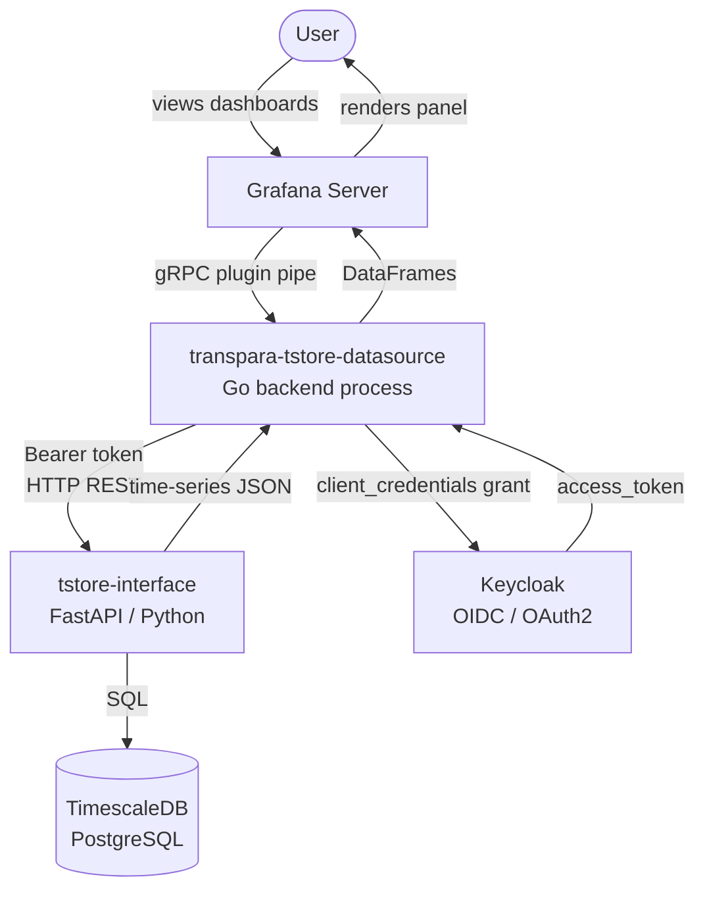
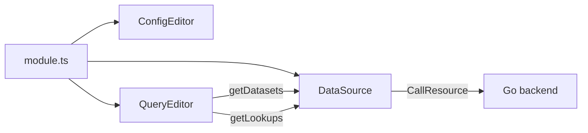
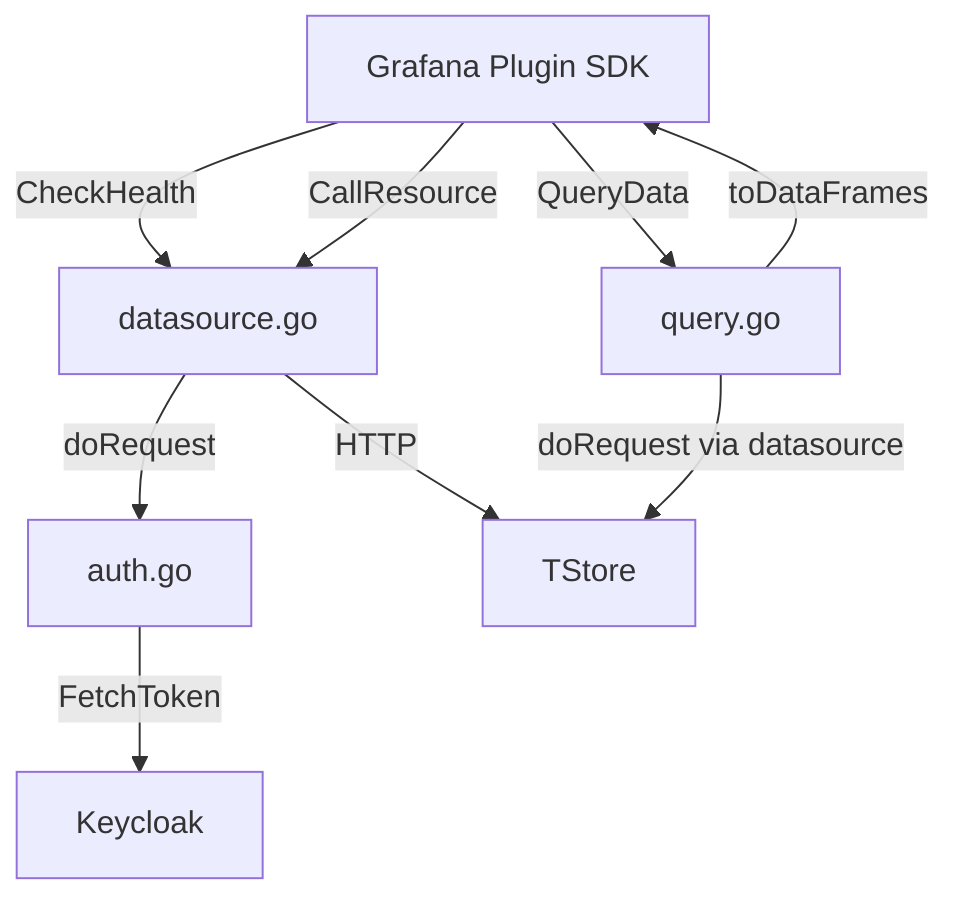
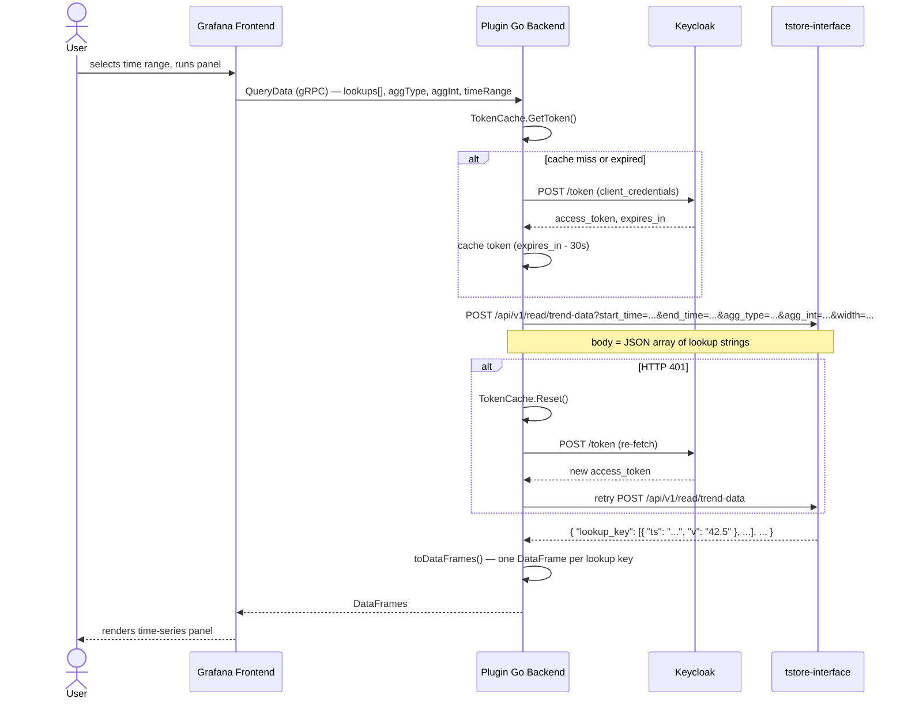
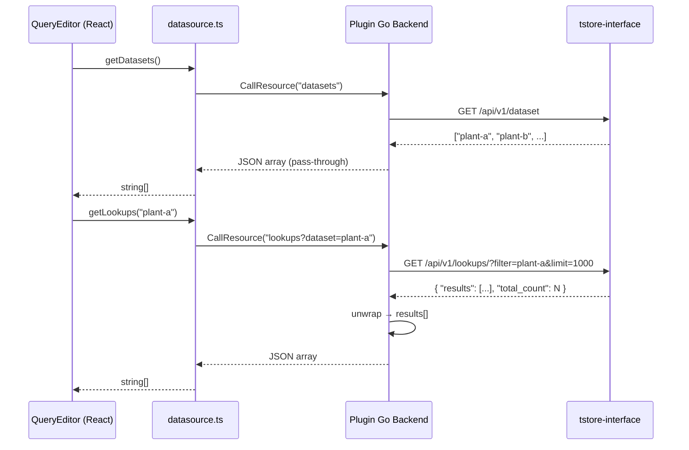
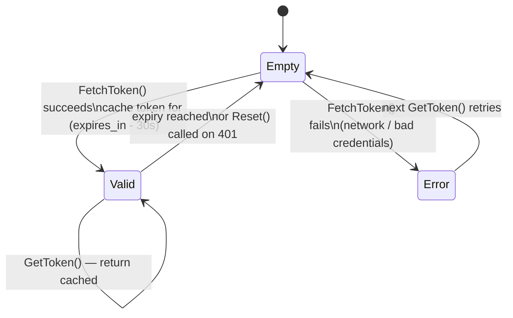

# Architecture

## System Context

The plugin sits between Grafana and the Transpara Platform. It has no database of its own — it translates Grafana queries into tstore-interface HTTP calls and maps the responses back into Grafana DataFrames.



Keycloak realm: `transpara`. The plugin uses the **client credentials** OAuth2 flow (service account — no user login). Tokens are cached in memory per datasource instance and refreshed automatically on expiry or HTTP 401.

---

## Components

### Frontend (TypeScript / React)



| File | Role |
|---|---|
| `src/module.ts` | Webpack entry point — wires the three classes together |
| `src/datasource.ts` | Extends `DataSourceWithBackend`; thin wrapper — only exposes `getDatasets()` and `getLookups()` via `CallResource` |
| `src/components/ConfigEditor.tsx` | Datasource config form (URL, token URL, client ID, client secret) |
| `src/components/QueryEditor.tsx` | Panel query editor — visual/raw toggle, dataset/lookup dropdowns, aggregation controls |
| `src/types.ts` | TypeScript interfaces for `MyQuery`, `MyDataSourceOptions`, `MySecureJsonData` |

The frontend does **no direct HTTP calls to tstore-interface**. All network requests go through the Go backend via Grafana's plugin pipe.

### Backend (Go)



| File | Role |
|---|---|
| `pkg/main.go` | Binary entry point — registers plugin factory with Grafana SDK |
| `pkg/plugin/datasource.go` | `Datasource` struct; implements `CheckHealth`, `CallResource`; `doRequest` with 401 retry |
| `pkg/plugin/query.go` | `QueryData`, `runQuery`, `toDataFrames`, `formatDuration` |
| `pkg/plugin/auth.go` | `TokenCache` (mutex-protected), `FetchToken` (client credentials POST) |

---

## Data Flow: Panel Query



### Data Flow: Dropdown Population



---

## Auth: Token Cache State



Token lifetime: whatever Keycloak issues minus a 30-second safety buffer. If a 401 comes back from tstore-interface mid-flight, the cache is cleared and the request retries exactly once with a fresh token. A second consecutive 401 is returned as an error.

---

## Lookup String Format

The lookup string is the central data model shared between the frontend, the Go backend, and tstore-interface.

```
dataset|filter|agg_type|agg_int
```

Examples:
```
plant-a|sensor_id=motor-1,unit=rpm|avg|5m
plant-a|sensor_id=motor-1,unit=rpm
```

| Segment | Description |
|---|---|
| `dataset` | The tstore dataset name (e.g. `plant-a`) |
| `filter` | Comma-separated label pairs identifying the time series |
| `agg_type` | Aggregation function (`avg`, `min`, `max`, `sum`, `count`, `median`, `twavg`, `raw`). In visual mode this is a separate query param, not embedded in the string. |
| `agg_int` | Aggregation interval (e.g. `5m`, `1h`). Also a separate query param in visual mode. |

In **visual mode**, `agg_type` and `agg_int` are sent as URL query parameters — the lookup strings in the body contain only the first two segments. The Go backend splices in the query-level values. In **raw mode**, the user supplies the full JSON array verbatim; the backend forwards it unchanged.

The Grafana panel legend shows the `filter` segment (index 1) as the series name, not the full string.

---

## tstore-interface API Surface Used

| Method | Path | Used by |
|---|---|---|
| `GET` | `/api/v1/up` | `CheckHealth` |
| `GET` | `/api/v1/dataset` | `CallResource("datasets")` |
| `GET` | `/api/v1/lookups/?filter=<dataset>&limit=1000` | `CallResource("lookups?dataset=<name>")` |
| `POST` | `/api/v1/read/trend-data?<params>` | `QueryData` |

All requests carry a `Bearer <token>` header. The tstore-interface base URL is configured per datasource instance and never hard-coded.
